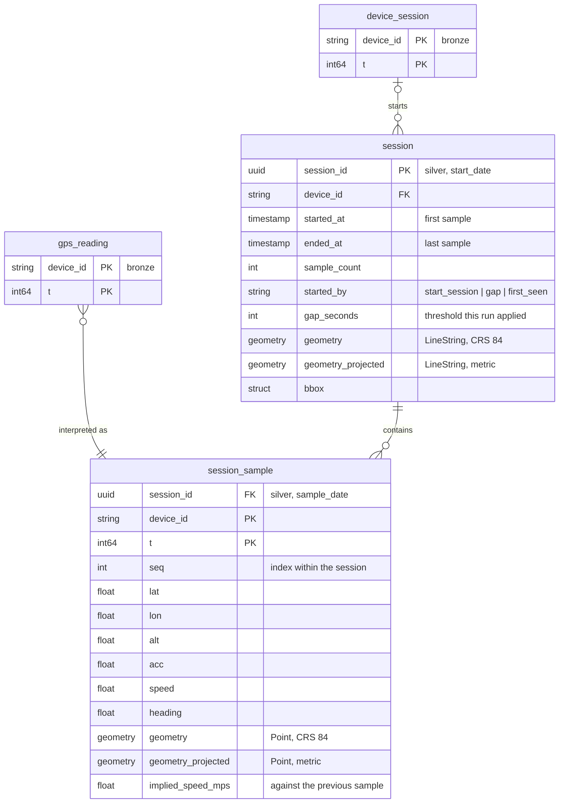
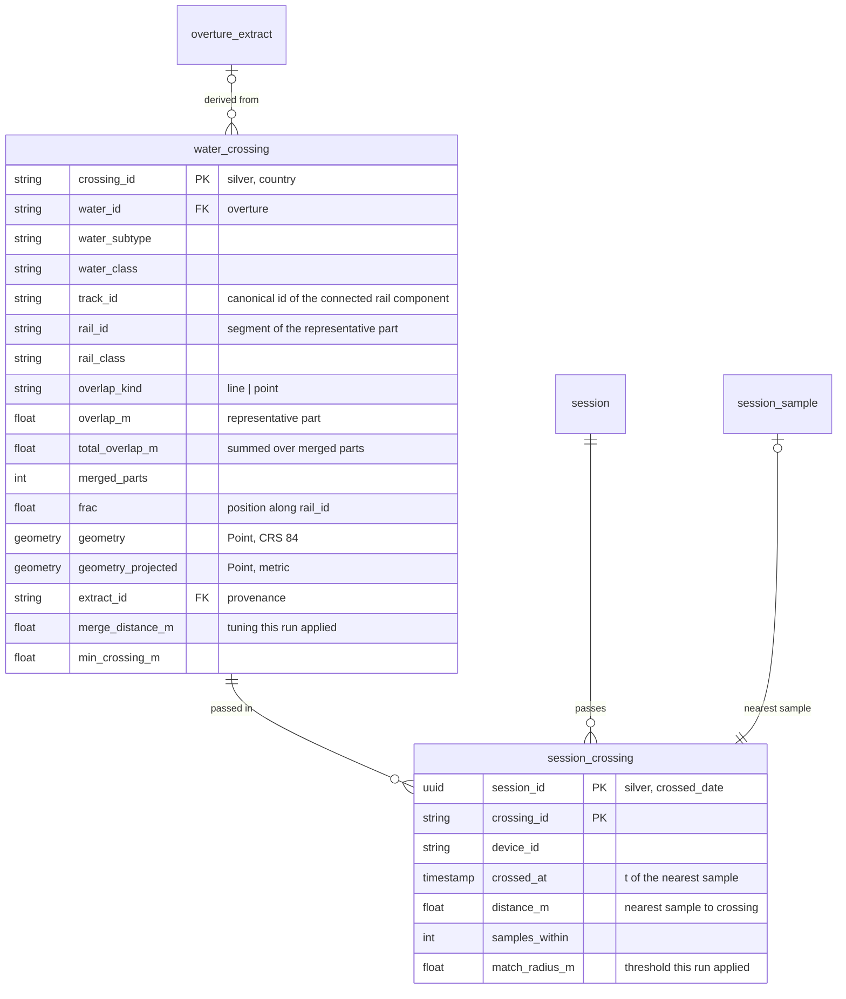

# Current Slice: minimal predictor and evaluation framework 

### Target

We should now have enough to put together a first minimal predictor that is based solely on crow-flies distance, and also to evaluate how good it is.

### Straw man

The essential idea here is to use our collected traces along with known water crossings to both act as source data and as measurement.

#### Sessionisation

So, we first find all gps readings from real traces and "sessionise" them. This effectively boils down to breaking the data from the same device into sessions whenever:
1. There is an explicit `StartSession` message
2. There is a gap of N minutes between successive readings (N = 10 minutes probably good enough)

#### Water crossings per session

Then, we look at any gps readings in each session that come within M metres of a known water crossing. This is where it is probably a good idea to first normalise a session to include a version of the path that has a CRS in metres (a projected CRS). Same goes for the water crossings dataset. For simplicity, since we are covering Germany, it'd be enough to use a single CRS for now.

Once we have some gps readings for each water crossing for each session, we minimise this to just a single example for each water crossing per trace, using the closest match. This should give us a set of water crossings per session. We treat this as our ground truth.

#### Simple crow-flies predictor

We then implement a simple predictor with a prediction cycle which functions something like:
1. Receive latest GPS reading
2. Find all water crossings within D distance (in metres); remember this for later
3. If we have a previous set of water crossings:
    * find overlap between sets, and compare distances for each pair of old and new, and work out distance delta (delta = new - old)
    * for those where delta is negative (we've gotten closer) calculate velocity
    * emit prediction of wall-clock time we will pass each water crossing based on current distance to water crossing and current velocity towards it

In this simple predictor we are not taking advantage of any speed or heading information in the GPS readings. That will be sensible to include later, but for now we can keep it simple. Later on we'll likely want to include any additional information we have in a sensor-fusion approach but for now we keep it simple.

#### Evaluation framework

We can think of a predictor as attempting to fill in, at each prediction cycle, a 2D space where the y-axis is all the possible water crossings and the x-axis is the time at which the water will be crossed in this session. 

We can run this for each gps reading in each session (each prediction cycle) and then assess as follows:
* precision = for each water crossing, whenever we predicted that we would cross at time T_P, what was the actual T_A, and was it within some tolerance e.g. 30 seconds. Similarly, was it within some distance. Count each of these as a boolean yes/no
* recall = for each water crossing that was really passed in a session, did we make a prediction for it?

This measurement framework and predictor can both likely be improved, but it's probably enough to start with.

### Refactor to Medallion Architecture

I think at this point we need to cleanly separate our bits of data processing and storage into a [medallion architecture](https://motherduck.com/glossary/medallion-architecture/). In this context this means something like:
* landing/external:
    * we can think this as where raw recordings are made in a native live format. So, redis is in here, and things like `motis_poll` should dump stuff here.
* bronze:
    * raw gps and accel sensor readings, recorded live in redis and extracted via `recorder` from live redis
    * motis train samples, recorded via `motis_poll` (sitting in landing) but extracted here via `motis_ingest`
    * point in time extracts from OvertureMaps restricted to our needs e.g. rail/water for Germany
* silver:
    * gps readings sessionised and normalised into standard geometries
    * derived water crossings, represented as an enriched OvertureMaps segments and connector dataset extended/restricted to only what we need
* gold:
    * results of runs evaluating particular predictor versions against silver datasets
    * preparations of data for live usage externally

In principle, as long as we always keep everything in bronze, everything in silver and gold should be rederivable. We shouldn't aim to delete from silver/gold as that slows things down a lot rederiving things, but we can if we need to. bronze must be immutable and versioned, not just append-only.

We also want to start standardising on representions i.e. where possible we should use parquet, but with different biases in each section:
* landing/external:
    * it's ok to continue to store things here optimised for fast in-place update by a single writer e.g. sqlite
* bronze:
    * parquet optimised for quick append of new data; we generally never delete anything from here, and we want to make appends quick and save. The structures should be biased towards sample structure e.g. each unique poll by `motis_poll` should get a timestamp which records when the poll happened and this should be part of the folder structure.
    * we don't need to worry *too much* about lots of small files here because:
        1. We will generally be doing any querying on silver datasets
        2. we don't store things like individual gps/accel entries as files as `recorder. drain` and `motis_ingest` can extract many readings into a batch and we do a write per-batch. So, we end up with a separate file for eacg time ingestion is run as opposed to for each data point.
    * *if we receive it from somewhere* we allow storage here in compact geo formats like [polyline](https://developers.google.com/maps/documentation/utilities/polylinealgorithm) as that's the sort of formats live services use for capturing paths. note that this is not our preferred format for everything in bronze as it doesn't allow representation of everything we care about, but if we receive it from some third-party service then we should store it.
        * if we are generating our own geo formats then we should favour using the same formats as in silver
    * we store extracts from OvertureMaps here largely in the native format they use, but add metadata like when what version of overturemaps was used (in case not already present). this extract may come from a bounding-box restriction we applied so we also add that as metadata
        * the metadata can be stored in a separate table I own, for example containing data of extract, unique extract id, and bounding box. the overture maps table may then only need to be enriched with the extract id as an additional column.
* silver:
    * here parquet is optimised for fast and scalable lookup and processing. this means embedding whatever metadata possible (like bounding boxes) to make queries faster
    * we should use [GeoParquet](https://geoparquet.org) ([v1.1.0](https://geoparquet.org/releases/v1.1.0/)) and ensure everything represents geographic concepts in the same way ([WKB geometry encoding](https://libgeos.org/specifications/wkb/), [simple features](https://www.ogc.org/standards/sfa))
        * there is also GEOMETRY/GEOGRAPHY [geospatial types](https://parquet.apache.org/docs/file-format/types/geospatial/) but these aren't well-supported by many apps / libraries right now
    * when we are extending/subsetting OvertureMaps data and storing here, we should always follow their schemas where possible, even for our own extensions to the data. however, additional, even when we are creating our own data from scratch, we should still follow their schemas as they are likely suitable for what we are doing as well
    * when storing paths or other geo entities, we should *always* have a normalised clean lat/lon representation in a global CRS
        * optionally, we can also eagerly pre-calculate a column in a projected CRS which is most appropriate for the entity. So, for example, for segments in germany we store in a single projected UTM Zone. There are technically multiple zones that cover Germany but it's most practical and useful to have a single zone per country
        * we should ensure CRS is in the GeoParquet metadata (PROJJSON),
* gold:
    * this is where we may produce specialised output formats, like [PMTiles](https://docs.protomaps.com/pmtiles/) / [protomaps](https://protomaps.com/about), intended to be used by live systems. This is also again where things like polylines are allowed/encouraged.
    * where specific formats aren't appropriate, geoarrow ([v0.2](https://geoarrow.org)) should be used to allow easy/fast export/import
        * some things, like kepler.gl, don't support compressed geoarrow so we should use uncompressed for now

The root where this data is stored is `data/medallion` in the repo, so the layers that cannot be re-derived are versioned with the code that wrote them; `--medallion-root` points a run elsewhere, at the external drive `/Volumes/PRO-G40/Data/geo/lookout/medallion` if it outgrows the repo. Data should be stored in Hive format.

One intent here is to standardis to allow multiple writer/readers, which are different engines, as appropriate i.e. Duckdb, SedonaDB, georust. Any file in silver must be readable by all three engines with no engine-specific handling.

#### Tasks

The main tasks here should be focussed on documenting these patterns and correctinh any conflicting info (e.g. in target.md) and updating the cli's like `motis_poll` and `motis_ingest` to follow them. Further sets of Tasks then need to follow these patterns.

- [x] Write `docs/medallion.md`: the layer definitions above, the root path
      (Hive-partitioned; `data/medallion` in the repo since the store moved there), the
      per-layer format rules
      (parquet append-shaped in bronze, GeoParquet 1.1 / WKB / simple features in silver,
      PMTiles / uncompressed GeoArrow in gold), and the multi-engine rule (silver stays
      independent of any one engine — currently DuckDB, SedonaDB and georust must all read
      it with no engine-specific handling).
- [x] Fix conflicting statements in `docs/target.md` (which currently says "sensor data is
      persisted in sqlite") and in `.claude/memory/lookout-architecture.md` (the
      "Rust derives tables into `lookout.sqlite`, Python reads" convention) so they point
      at the medallion layout, keeping sqlite explicitly as a landing/external format.
- [x] Define the Hive partitioning keys per dataset up front (e.g. bronze sensors by
      `dataset/ingested_at_date/`, motis polls by poll timestamp, Overture extracts by
      `extract_id`) and record them in `docs/medallion.md` — path layout is the schema
      here and is expensive to change later.
- [x] Add a small shared Rust `medallion` module (paths + layer roots + writer helpers)
      so the CLIs don't each hand-roll path construction, including a shared clap args
      struct giving every CLI the same `--medallion-root` flag and default.
      Note: built as its own `medallion` crate rather than a module in `shared`, so the
      parquet/arrow dependencies stay off the crates that don't need them (`server` in
      particular, which is deployed). Writes go through `object_store`'s `LocalFileSystem`
      + `ParquetObjectWriter` for atomicity, so `write_batches` is async.
      For later bulk writes spanning many partitions (silver rebuilds, gold exports),
      DataFusion's `DataFrameWriteOptions::with_partition_by` derives `key=value`
      directories from column values — worth using there, but it generates its own file
      names, so it doesn't fit the one-file-per-ingestion bronze writes.
- [x] Prove the multi-engine rule with a round-trip test: write one silver GeoParquet from
      Rust, read it back from each engine in use (currently DuckDB, SedonaDB, georust), and
      assert identical geometry + CRS. This is the check that stops silver drifting
      engine-specific.
      Note: `crates/medallion/tests/multi_engine.rs`, in the default nextest profile so it
      runs on every `just test`. DuckDB links the system libduckdb (`brew install duckdb`,
      added to `just prerequisites`, paths in `.cargo/config.toml`) — the bundled build
      needs a C++ toolchain that isn't available in the sandbox.
- [x] Move `motis_poll` to write into landing/bronze: keep the raw polled `TripSegment`
      batch (polylines verbatim, as received) as one parquet file per poll under a
      timestamped Hive path, rather than appending to `data/motis.sqlite`.
      Note: `motis::bronze::SegmentLog` writes it; rows are defined once as a serde struct
      and turned into arrow by `serde_arrow`. `crates/motis/src/store.rs` (sqlite) stays
      for now because `motis_ingest` still reads it — remove it with the ingest task.
- [x] Move `motis_ingest` to read that bronze poll data and write its deduped, decoded
      `train_segment` output as silver GeoParquet (WKB, CRS 84, plus a pre-projected
      UTM-for-Germany column), rather than into `lookout.sqlite`.
      Note: dedup is a plain Rust fold over the bronze rows rather than a SQL window
      function, since the volume is small and it needs no engine. `store.rs`/`migrate.rs`
      are gone with the sqlite log. Projection uses `proj4rs` (pure Rust, no system PROJ)
      via `medallion::Projector`; `visualise` still reads the old `train_segment` sqlite
      table until the task below repoints it.
- [x] Move `recorder drain` output to bronze: one parquet file per drain batch of raw
      gps/accel readings (the lossless `raw` payload stays the source of truth).
      Note: written as four datasets — `raw_sample`, `gps_reading`, `accel_reading`,
      `device_session` — rather than one under a `sensor=` partition, since the sensors
      carry different columns and a dataset is one schema; `medallion.md` updated to
      match. A drain writes in batches of 100 rather than once at the end, bounding what
      a failed write followed by a failed requeue can lose.
- [x] Move the Overture extracts (`transport::enrich` rail, and the water extract from the
      water-crossings notebooks) to bronze in Overture's native shape, with an
      `extract` metadata table (extract id, date, Overture release, bounding box) and an
      `extract_id` column joined onto the extracted rows.

      Decisions taken before starting, as each changes what gets built:

      * **One extraction covers both rail and water**, not one per theme. The two are
        joined to each other (the crossings pipeline range-joins rail envelopes against
        water envelopes), so a single `extract_id` keeps that join within one provenance
        record and one release. `extract_id` is the outermost key, with Overture's own
        `theme=`/`type=` layout below it, so both themes sit under the one extraction.
      * **The extraction window is the country, not the observed bboxes.** `enrich`
        currently derives per-`(device, UTC day)` bboxes and fetches only what intersects
        them; the notebooks extract Germany-wide from the country division's boundary. One
        extraction serving both has to use the wider window, so the window is the country
        bbox and the manifest records it. Narrowing to observed bboxes stays available to
        the silver derivations, which is where a query-shaped subset belongs.
      * **`theme=divisions` is extracted too**, though it is neither rail nor water. The
        country window itself is derived from the `division_area` country boundary, so an
        extraction that doesn't record it can't be re-derived from what it stored; the
        notebooks additionally clip against that boundary and label with `division`
        localities. Leaving divisions out would keep a live S3 dependency in the notebooks
        and defeat the point of recording a release.
      * **Bronze keeps Overture's rows verbatim.** `overture.rs` today flattens Overture's
        `bbox` struct into `min_lon`/`max_lon`/`min_lat`/`max_lat` and converts geometry
        with `ST_AsBinary`. That is silver shaping and does not belong in the bronze
        extract — it moves to the derivation that reads the extract. The only column bronze
        adds is `extract_id`.

      Steps:

      - [x] Define the two datasets in `model`: the extract itself (bronze, keyed
            `extract_id`) and the manifest (bronze, unpartitioned — id, extraction
            instant, Overture release, bbox). This needs two things loosening first: the
            `model` test asserting *every* partition key ends with `_date` (it should
            assert that date-valued keys name their event, not that all keys are dates),
            and `medallion::Dataset`, which offers `on_date` but no way to partition on an
            id.
      - [x] Extract both themes to bronze under one `extract_id`: `theme=transportation`
            rail segments and their connectors, and `theme=base` water, each restricted to
            the country window and written in Overture's shape plus `extract_id`. Write
            the manifest row for the extraction.
            Note: `transport::extract`, driven by the `extract` bin, which takes the
            release from the bucket or from `--mirror`. Two caveats the extract carries,
            both inherent to restricting by envelope rather than by boundary. Connectors
            are kept only where the connector's own point falls in the window, so ~0.4% of
            those a kept rail segment references (2,017 of 464,555 for DE) are absent —
            endpoints of segments clipping the frontier. And a row is kept when its
            envelope *overlaps* the window, so water reaches to lon -4.0 against a window
            starting at 5.9: the North Sea is one polygon. Neither is a defect to fix here;
            silver clips precisely against the boundary.
      - [-] Repoint `enrich`'s input off sqlite: the bboxes it derives come from bronze
            `gps_reading`, not the `gps` table of `data/lookout.sqlite`. Leaving this on
            sqlite would re-establish the dependency this migration exists to remove.
            `transport::archive` (the sqlite reader) and `transport::store` (the sqlite
            `transport` table) both go.
            Moot: `enrich` is removed rather than migrated. Its purpose was to fetch the
            Overture data intersecting the observed bboxes, and the country-wide extract
            now covers that, so migrating it would leave two ways in with nothing to
            choose between them. The narrowing it did — Overture restricted to where we
            have actually been — is still wanted, but it belongs to a silver derivation
            over sessionised samples rather than to a fetch, and is better built once
            sessions exist. `archive`, `groups` and `store` go with it, taking transport's
            last sqlite dependency; `data/lookout.sqlite`'s existing `transport` table is
            untouched and `visualise` still reads it until repointed below.
      - [x] Point the water-crossings notebooks at the bronze extract instead of S3 or the
            `/Volumes/PRO-G40` Overture mirror, so a rerun is reproducible against a
            recorded release rather than against whatever S3 currently holds. The
            `USE_LOCAL` mirror fallback goes with it.
            Note: done as a new `v8`, not an edit of `v7` — the earlier versions are the
            record of what was run at the time, and rewriting them to read an extract that
            did not exist then would falsify it. v8 pins an `extract_id` and reads the
            manifest for the release behind it, so adopting a later extract is a deliberate
            edit. Its three test cases pass unchanged, which is what says the extract lost
            nothing the pipeline depends on. Note v8 only runs where that extract exists:
            nothing in the repo recreates a *given* id, since a rerun of `just extract`
            makes a new one.
- [x] Port `visualise/` from `sqlite3` to DuckDB over the medallion store. It is the last
      reader of `data/lookout.sqlite`, and the point is the engine, not just the path: the
      store is parquet that any of our engines reads, and DuckDB is the one we already use
      for ad-hoc and notebook work, so a hand-rolled reader has nothing to recommend it.
      DuckDB also reads the silver GeoParquet geometry directly, which drops the
      WKB-blob-to-shapely step the sqlite reader needs.

      Its four tables do not migrate alike, and that is most of the work:

      * `gps` and `accel` become bronze `gps_reading` / `accel_reading`. Straightforward,
        and these are what "the rerun output is unchanged" can actually be checked against.
      * `train_segment` becomes the silver dataset of that name — already written, already
        GeoParquet.
      * `transport` has no writer at all now `enrich` is gone, so that pane cannot be
        repointed, only re-sourced. **Drop it**, along with its map pane and the blueprint
        entry for it, and restore it once the silver rail derivation exists. Keeping
        `visualise` on sqlite for this one table would hold the whole file's sqlite reader
        open to serve a pane whose data stops ageing anyway, and the restored pane will
        read the silver dataset rather than the old `transport` shape, so the code being
        deleted is not the code that comes back.

      The `--since` window and `--devices` filter are predicates over Hive partitions here
      rather than a `WHERE` over a table scan, so check what a date-partition predicate
      actually does before assuming it prunes (see the partition-column typing task below —
      this is the case that motivates it).

      Notes:

      * **DuckDB prunes.** An inferred hive key comes back typed (`typeof(ingested_date)`
        is `DATE`), a predicate over it appears as a `File Filters` entry, and the plan
        reports `Scanning Files: n/m` — both asserted in the tests. One caveat: the *first*
        file in glob order is still opened, for the schema, whether or not the filter
        excludes its partition.
      * `--since` filters `t` (when the reading was taken) but prunes on `ingested_date`
        (when it was written), which is sound only because ingestion follows the reading. A
        device whose clock runs ahead by more than the window is the exception, and its
        readings are mistimed either way. Legs prune on `departure_date` with a day's
        slack, since the window is over `arrival`.
      * **shapely is gone**, and `--near` with it (that flag only filtered the dropped
        transport pane). Route vertices and the moving dot's interpolated positions are read
        as lat/lon out of the query, via `ST_PointN`/`ST_LineInterpolatePoint`, so nothing
        decodes WKB here. Not by casting to DuckDB's native `LINESTRING_2D`/`POINT_2D`,
        which is what the geometry column *looks* like it wants: that cast is unimplemented
        for a geometry whose CRS the engine recognised, and whether it does recognise one
        varies by writer — a duckdb-written file types the column `GEOMETRY('OGC:CRS84')`
        and a Rust-written one plain `GEOMETRY`, from the same PROJJSON.
      * Checked end to end against files the real writers produced (bronze from
        `recorder::bronze::Archive`, silver from `motis::ingest`, into a scratch root),
        since the Python tests build their fixtures with DuckDB itself and so would not
        catch a Rust-writer/DuckDB-reader mismatch on their own.
- [x] Backfill existing `data/lookout.sqlite` and `data/motis.sqlite` content into bronze
      once, so history isn't stranded behind the old format.

      Notes:

      * `just backfill` runs it: `backfill_telemetry` (from `lookout.sqlite`),
        `backfill_segments` (from `motis.sqlite`), then `motis_ingest` over the polls that
        adds. Both are one-shot and say so: the telemetry backfill refuses a second run
        (its check is whether the archive's oldest payload is already in bronze — the
        oldest being least likely to have also arrived through the queue at the
        changeover), and the segment backfill skips polls whose file is already there.
      * **Only `raw` is read from `lookout.sqlite`.** The readings are re-interpreted from
        it through the same `Archive` the live drain writes, so backfilled history is shaped
        by the current interpretation rather than by whatever wrote those older per-sensor
        tables. That the counts come out identical (4,028 gps / 4,911 accel) is the check
        that the re-interpretation lost nothing. `device_session` gains 15 rows where the
        old `device` table held 2, since bronze keeps every session rather than the latest
        per device.
      * The archive and the queue could have overlapped, which the run itself could not have
        told us: the refusal check tests only the oldest payload, and `recorder`'s default
        `view-latest` archives without removing anything from the queue, so a payload could
        have arrived by both routes. Measured after the run, bronze happened to hold 9,154
        rows for 9,154 distinct md5s and 4,108 gps rows for 4,108 distinct `(device_id, t)` —
        a snapshot, not an invariant, and not something a derivation may build on. The rule
        this is an instance of now sits in `medallion.md`: bronze tolerates a repeated
        observation, so deduping is the reader's job.
      * **`transport` is deliberately not backfilled.** It was `enrich`'s output: a subset
        of an Overture release with no record of which release or which window, so it can't
        be given the provenance bronze requires — and the country-wide extract supersedes
        it anyway.
      * `received_at` is absent for 458 payloads predating its capture, and is carried
        through as NULL rather than filled with a stand-in (`RawRow.received_at` is now
        `Option<i64>`; the queue's own `RawSample` still always carries one, so
        `Archive::write` takes a `Payload` either can produce).
      * 293 accel payloads predate the `rms`/`peak`/`n` aggregates, which `shared::Accel`
        defaults to zero — so in bronze they are indistinguishable from a measured zero and
        would plot as a flat-zero ride signal. `visualise` drops `n = 0` rows for that
        reason. Making the aggregates `Option` in `shared` would model it properly and is
        the better fix if this bites again; `raw_sample` keeps the truth either way.
      * Found while running this: **`Dataset::append` silently overwrote** a file whose
        instant-named path already existed, and names were only second-precision — so any
        writer issuing several appends within one second lost all but the last. That was live
        in `recorder drain` (batches of 100, well under a second apart), not just in the
        backfill. Names now carry milliseconds and an append onto an existing path fails, so
        a collision is loud and, in the drain's case, requeued. The existing collision test
        did not catch it because it compared instants a *second* apart; the new tests are two
        writes a millisecond apart, at both the path level and through `Archive`, and were
        checked by reverting the fix.
- [x] Decide whether partition columns should be declared with their types rather than
      inferred. SedonaDB auto-discovers them when the reader doesn't set them
      (`listing_table_factory_infer_partitions` defaults to true), typing every one as
      `Utf8View` — so a date partition comes back as a string, and a predicate has to
      compare it as one. Establish first what a date-typed predicate actually does against
      an inferred column (prunes, silently reads everything, or errors); declare the types
      via `GeoParquetReadOptions::with_table_partition_cols` only if that shows a reason to.

      **Decided: leave them inferred.** The rule is in `medallion.md`; measured by a spike
      (committed, then removed) rather than reasoned about:

      * A date-typed predicate against SedonaDB's inferred `Utf8View` key is neither rejected
        nor silently full-scanned. DataFusion coerces it —
        `CAST(ingested_date AS Date32) >= Date32("2026-07-24")` reaches the scan as a
        `full_filters` entry — and it prunes: the physical plan lists 2 of 3 files. Rows come
        back correct. A string-typed predicate prunes identically, uncast.
      * Declaring `Date32` changes the reported type and drops the cast, but scans the same
        2 of 3 files. No functional difference, so nothing to buy.
      * This rests on the `YYYY-MM-DD` format, where lexical and chronological order agree —
        recorded in `medallion.md`, since a different date format would break the equivalence.
      * **The corrupt-a-pruned-file technique used for DuckDB does not work against SedonaDB**
        and would have given a false positive here. A registered table serves content cached
        at registration: after corrupting a partition, a query selecting *only* that partition
        still returns its row, while a fresh context cannot open the store at all. Pruning
        evidence there has to come from the plan's `file_groups`, not from a query succeeding.
- [x] Delete `docs/2026-07-27-data-engineering-review.md` at the end of this slice. It is a
      dated snapshot of how this store compares to Rust data engineering practice, kept for
      the history of the decision; anything in it still worth following by then belongs in
      `medallion.md` or in a task, and the rest goes stale.
      Done once the refactor it was written to guide was finished, rather than waiting for the
      slice's remaining sections — its condition was met, and a redundant doc still reads as
      current. What survived it: the no-table-format decision and its trigger, into
      `medallion.md`; the date-range argument, a compaction plan and the leave-the-catalog-
      traits-alone decision, into a "make the store operable at size" slice in
      `next-slices.md`. Its partition-typing recommendation is the task above. The orchestration
      survey is deliberately dropped: the conclusion was "none yet, three CLIs run by hand are
      below the threshold", which is still true and needs no note, and any survey of what
      exists would be restated from scratch when the threshold is actually crossed.
- [x] Refuse to delete or overwrite outside the layers that permit it. Silver rebuilds
      replace whole partitions and sweep the ones a run no longer produces, and every
      `Dataset` offers those methods whatever layer it names — so
      `root.dataset(RAW_SAMPLE).retain_partitions(…)` compiles today and would take bronze
      with it. Bronze and landing are the only data in the store that cannot be re-derived,
      so the rule that they are append-only should be something the code enforces rather
      than something every caller remembers: check the layer on the replacing and sweeping
      paths and fail with a typed error, and test it over `model::ALL` so a bronze dataset
      added later is covered without anyone thinking about it. Append already refuses to
      land on an existing file, so this closes the remaining door.
      Note: the rule lives on `Layer` as `permits_replacement`, true for silver and gold
      only, and `Dataset` checks it on every replacing and sweeping path — so a dataset
      inherits it from the layer it is placed in rather than restating it, and a bronze
      dataset added later is covered by construction. `model` additionally spells out which
      datasets a rebuild may replace, so putting an observation dataset in a layer that
      permits replacement fails there rather than the first time something sweeps it. The
      guard caught a real caller immediately: `query`'s test fixture wrote its bronze rows
      with `replace_with`, which now refuses, and appends instead.
      Considered and not done: routing deletions into a `<root>/.deleted/<layer>/…` trash
      directory instead of removing them. It is the right shape if reversible deletion is
      ever wanted — a rename is atomic and free, and the trash must sit *outside* the layer
      directories or a reader globbing `silver/**/*.parquet` would read deleted partitions
      back — but with bronze undeletable and silver cheap to rebuild there is nothing left
      for it to save.
- [x] Make replacing an append-only dataset **fail to compile**, not fail at runtime. The
      check above is a backstop: it turns a destructive bug into an error, but only once the
      line runs, and a caller has no way to know it is holding something it must not replace
      until it tries. The layer of a dataset is fixed at its definition, so this is knowable
      statically.
      The evidence for doing this properly rather than partially: the runtime check landed on
      a codebase where `transport::extract` was already replacing a *bronze* dataset —
      `overture_extract` — so the check turned a working extract into a run that fails at the
      first write. Nothing caught it, because the test covering that path needs Docker and
      the sandbox profile skips it. A compile error would have been unmissable.
      **Make `DatasetSpec` generic over its layer**: marker types per layer, a `LayerKind`
      trait carrying the `Layer` value, and a `Derived` trait implemented only by silver and
      gold. `DatasetSpec<Bronze>` then constructs without naming its layer twice,
      `Root::dataset` and `Root::rows_of` return `Dataset<L>`, and the replacing and sweeping
      methods live in an `impl<L: Derived>` block — so replacing bronze is a missing method
      rather than an error value. `Row` carries the layer as an associated type, with
      `const DATASET: DatasetSpec<Self::Layer>`.
      What it costs, so it is not a surprise mid-change: `model::ALL` is one array and cannot
      hold specs of different layers, so it needs a type-erased view — a plain
      `DatasetInfo { layer, name, partition_key }` built by a `const fn` on the spec — and the
      checks over `ALL` move onto that. `Query::register` becomes generic. The runtime check
      and its error stay: they are what a type-erased path still needs, and deleting them
      would trade one guarantee for another rather than adding to it.
      Note: done as described, and the runtime check did *not* stay — with the layer in the
      spec's type there is no untyped way into a `Dataset`, so the check and its error were
      unreachable and went. `layers::{Landing,Bronze,Silver,Gold}` are plain unit structs
      implementing `LayerKind`, `Replaceable` is implemented for silver and gold, and the
      replacing and sweeping methods live in `impl<L: Replaceable> Dataset<L>`. `Row` carries
      its layer as an associated type, so both `root.dataset(RAW_SAMPLE)` and
      `root.rows_of::<GpsReadingRow>()` refuse at compile time — checked by writing the calls
      and reading the errors, then deleting the file. `model::ALL` became `[DatasetInfo; 10]`
      as expected. Two things fell out that are worth keeping: `silver::write_dates` now
      states `R: Row<Layer = layers::Silver>` in its signature, so a generic writer says which
      datasets it is for, and the test asserting the old runtime refusal was deleted rather
      than rewritten — a compile error is not something a test can assert without pulling in
      a compile-fail harness, and the guarantee is stronger than the test it replaces.
- [x] Host the store in the repo, at `apps/lookout/data/medallion`, so bronze is versioned
      with the code that wrote it. `data/` already tracks the pre-medallion `lookout.sqlite`
      and `motis.sqlite` — the same sensor data in its old form — so moving the store out to
      `~/Data` quietly lost that versioning, and git gives back the undelete that a
      versioned filesystem was wanted for. Bronze suits it: its files are immutable and
      append-only, so each blob is stored once and never re-stored as a modification.
      Ignore `silver/` and `gold/` (derivable by definition) and `bronze/overture_extract/`
      (1.5 GB), but **keep `bronze/extract_manifest/`**: it is a few rows naming the release
      and window each extract took, and since Overture releases are public and immutable an
      extract is re-derivable from its manifest row, which the sensor data is not.

      **The repo store is the default**, not an opt-in: `Root::default_path` resolves to it
      and `--medallion-root` remains the way to point somewhere else, so nothing needs an
      env var or a per-recipe flag to work on the normal store. The default is found by
      **walking up from the working directory for the workspace marker**, as cargo does, and
      taking `data/medallion` under it. A plain relative `data/medallion` would be less code
      but silently creates a second store whenever a binary runs from another directory,
      which is exactly the accident this task exists to prevent. Finding no marker is an
      error naming what was looked for, not a fallback to a guess — a store in the wrong
      place is worse than a run that refuses to start. Note that `medallion.md` and
      `MedallionArgs`' tests both name the old `~/Data` path, and moving the store means
      copying bronze across and re-deriving silver rather than moving it whole.

      Everything except the extracts is 20 MB over ~1300 files today, against 19 MB of
      sqlite already tracked; `motis_segment` is 17 MB of it and the only one that grows
      with use, so it is the one to watch. This also puts the store inside what the sandbox
      can read, so a run and its checks stop needing a shell outside it.
      Note: the area and the wiring are in place; the data itself is copied across by hand,
      so bronze appears in git in one deliberate commit rather than as a side effect of a
      refactor. `data/medallion/.gitignore` states what is versioned. `Root::default_path`
      walks up for the workspace manifest and `MedallionArgs::root` is fallible, so a binary
      run outside the repo says it cannot find a store instead of inventing one; the flag
      stayed the way to name another. The Python readers walk up the same way rather than
      each holding a path — `visualise/main.py` and the sessions notebook, edited through
      the live kernel rather than on disk.
      Correction, found when `just silver` failed on 2026-08-01: the Python walks used
      `Path.cwd().parents`, which **excludes the working directory itself**, where Rust's
      `ancestors()` includes it. The workspace manifest sits in `apps/lookout` and that is
      where the recipes run, so every Python reader failed there — with a bare
      `StopIteration`, naming nothing. They now start at the working directory and say what
      they looked for when there is no workspace above it. The notebook that *writes* no
      longer walks at all: `lookout_medallion` exposes `default_root()` over
      `Root::default_path()`, so it asks the same code its writes go through and cannot read
      one store while writing another.

### Sessionisation

Sessionisation reads bronze, so it **dedups rather than assumes distinct readings** —
see the rule in `docs/medallion.md`. Concretely: a sample is identified by `(device_id,
t)`, and the collapse on that identity happens before any gap-splitting, since a
repeated sample would otherwise look like a zero-gap sample and could split or merge a
session wrongly.

#### The entities

A `session` is one contiguous run of samples from one device; a `session_sample` is one
deduped GPS sample within it.

A sample's identity is `(device_id, t)` — the natural key it dedups bronze on.
`device_id` is repeated on the sample rather than reached through `session_id`, so a
`sample_date` partition is readable without joining back to a dataset partitioned by a
different date.

#### Tasks

Decisions taken before starting, as each changes what gets built:

* **Silver keeps every sample and flags the doubtful ones**, rather than filtering them
  out. Accuracy and speed-jump thresholds are tuning constants of a consumer, not
  properties of the data: baking one into the derivation would put it in the store,
  where changing it means rederiving everything, and would leave the ground truth and
  the predictor unable to disagree about what counts as a usable sample. Silver
  therefore carries what a filter needs — reported accuracy and the speed implied by the
  previous sample — and each consumer draws its own line.
* **GPS only.** Accel readings are not assigned to sessions here. The predictor in this
  slice is crow-flies over GPS, and sessionising a sensor nothing reads would fix its shape
  before there is a reader to fix it against. The session boundaries will be the same when
  sensor fusion wants them.
* **A run rebuilds every session from all of bronze**, and `session_id` is derived
  deterministically from `(device_id, first sample instant)` rather than minted per run.
  The newest session is always still open — more samples for it arrive with the next
  drain — so a run has to be able to re-derive a session it has already written and land
  on the same id, and `medallion.md` already requires a silver transform to be
  idempotent. Volume is small enough that rebuilding all history is affordable; if it
  stops being so, the fix is a rebuild window, which is a change to this task and not to
  the datasets.
* **It lives in `recorder`**, next to the bronze telemetry writer, driven by its own bin —
  the shape `motis` already has with `bronze.rs` and `ingest.rs`. Sessions are a derivation
  of the telemetry datasets, so putting them in the crate that owns those datasets keeps
  one crate answerable for their schema on both sides.

Steps:

- [x] Move the silver row structs into `model`, so a dataset's columns are declared once
      where its layer and partitioning already are, rather than in whichever crate happens
      to write it. `model` today names datasets but says nothing about their shape, and
      each writer declares its own serde struct (`recorder::bronze`'s rows,
      `motis::ingest`'s `Leg`), which leaves a reader with no typed way to read a dataset
      it did not write. Row structs are the definition of these entities; the relations
      between them stay documentation (the diagram above), since a foreign-key registry
      nothing enforces at write time would not earn its keep at two datasets.
- [x] Define `session` and `session_sample` in `model` — the columns above, both silver,
      partitioned `start_date` and `sample_date` as `medallion.md` already pins. A session
      spanning midnight has its samples split across two partitions and is reassembled by
      `session_id`, so that column is carried on every sample.
      Note: `started_by` is a Rust enum, which needed a store-wide decision about how a
      closed set of names is stored. It is a plain string column: tracing an enum yields a
      *dictionary* of the variant names, and the dictionary is dropped from the schema
      rather than carried into it, since the encoding is the parquet writer's business and
      an engine reading the arrow metadata would otherwise hand back a different type than
      one that doesn't. The rule is in `medallion.md`, alongside the instant rule that was
      until now only expressed in code.
      `t` is a timestamp here rather than the epoch-millis integer bronze carries, as are
      `started_at`/`ended_at`, and `bbox` is one struct of `xmin`/`ymin`/`xmax`/`ymax`
      following the upstream reference data's own envelope naming.
- [x] Derive the session boundaries from bronze `gps_reading` and `device_session`:
      dedup on `(device_id, t)`, order by `t`, and start a new session at an explicit
      `StartSession` for that device or after a gap exceeding the threshold (`--gap`,
      default 10 minutes). Two cases the rule has to answer explicitly, since both exist
      in the recorded data: samples with no preceding `StartSession` at all (the v0
      protocol has no such message) still form sessions, and a `StartSession` no sample
      follows produces no session rather than an empty one. Record the gap threshold as
      a column on `session`, so a session written under one threshold is still
      interpretable after it changes. Note: `recorder::sessions` derives the boundaries
      and holds them in memory; writing them, and with them the `gap_seconds` column,
      belongs to the two tasks below. The `--gap` flag arrives with the bin, so the
      threshold is a `Gap` argument for now. Two rules the task left open, both decided
      here and tested: an interval of *exactly* the threshold does not split (the
      threshold is the longest silence a session survives), and a reported session start
      outranks both inferred reasons, so a sample following one is `start_session` even
      when it also follows a long silence. Dedup keeps the first row of a total order
      over the reported values rather than an arbitrary row of the group, since two rows
      sharing `(device_id, t)` but disagreeing on what was measured would otherwise let
      a rerun pick differently.
- [x] Give each session its deterministic id and write `session_sample`: one row per
      sample, carrying `session_id`, the bronze columns, a CRS 84 point geometry and the
      pre-projected metric one, and the flag columns above (`acc` as reported, the
      implied speed from the previous sample in the session, and whether `t` went
      backwards). Implied speed is metric, so it comes from the projected geometry, not
      from degrees.
      Note: `backwards_in_time` is dropped rather than written. Samples are ordered by
      `t` before they are split, so within a session `t` never decreases and the flag
      could only ever be false — a column a reader would reasonably mistake for evidence
      that no clock stepped backwards. Detecting one needs the order the samples
      *arrived*, which bronze `gps_reading` does not carry; the flag can come back with
      it. The id is a name-based UUID over `(device_id, first sample instant)`, so a
      reader holding only the boundaries can name a session without reading the store.
      Building a batch of rows plus its geometry columns moved into `medallion` as
      `geo_batch`, since `motis::ingest` was already doing it by hand.
- [x] Write `session` itself: one row per session with its device, start and end
      instants, sample count, the path as a CRS 84 LineString plus its projected twin,
      and the bbox. The bbox is what makes "which sessions could have come near this
      crossing" cheap, and the path is what the crossings step matches against — neither
      should be recomputed from the samples by every reader.
      Note: the bbox is in lat/lon, matching the geometry the upstream reference data
      puts its own envelopes in, so a bbox-to-bbox prune compares like with like. A
      session of a single sample stands still rather than having no path: its point is
      repeated, since a LineString of one coordinate is malformed under simple features.
      Both datasets are written by one call, which projects each session once — the
      sample rows and the session path need the same projected points. The gap threshold
      a session was derived under travels on the `Session` itself rather than being
      passed to the writer, so the column cannot disagree with the split it describes.
- [x] Give `medallion` a way to **replace** a set of silver partitions in one run, since
      everything written so far appends one file per batch and a rebuild that appends
      duplicates its own output. DataFusion's `DataFrameWriteOptions::with_partition_by`
      derives the `key=value` directories from a column, which fits a bulk write spanning
      many partitions (noted already under the medallion crate task); what it does not
      settle is what happens to a partition that exists but the rebuild no longer produces
      any rows for. Decide that explicitly — silver permits deletion — and make the
      behaviour the same for every silver rebuild rather than per-writer.
      Note: `Dataset::replace_dates_geo` takes the whole dataset's batches keyed by date,
      writes one file per date and **deletes** every other partition under the dataset's
      own key. A partition the derivation no longer produces rows for is a claim it has
      withdrawn, and a reader has no way to tell one from a current partition. The sweep
      is bounded by the dataset's own partition key, so a directory under another key, or
      a file, is not this dataset's to remove. `DataFusion`'s `with_partition_by` was not
      used: the batches are already grouped per partition in memory, it would not name
      the file `part-0.parquet`, and it settles nothing about the stale partitions, which
      is the part that actually needed deciding. `motis::ingest` moved onto the same call;
      `transport::extract` did not, since its partitions are per-extract streams rather
      than a dated rebuild.
- [x] Test that a rerun over unchanged bronze produces identical partitions, and that a
      rerun over bronze that has grown by more samples for the open session extends that
      session rather than creating a second one. This is the check the deterministic id
      and the full rebuild exist to pass, and it is the one that breaks silently
      otherwise.
      Note: in `crates/recorder/tests/sessionise.rs`, driving bronze through the archive
      the drain writes with. "Identical" is checked as the partition files present, their
      sizes, and every row a reader gets back including geometry — not byte equality:
      GeoParquet's file metadata lists a dataset's geometry columns as a map, which
      serialises in a different key order from one write to the next while nothing about
      the data varies. Two further reruns are covered: a repeated sample from a re-sent
      queue tail changes nothing, and samples after a silence longer than the threshold
      start a second session while leaving the first untouched. Both a random
      `session_id` and a disabled dedup were confirmed to fail these tests.
- [x] Derive a session's country rather than being told it. The projected CRS is chosen
      per country, so today every writer is handed `--country` and every session in a run
      gets the same one — a fact about the run, not about the session. Decide it from
      where the session's first sample falls: the country whose area contains that point.
      Only Germany is supported, which covers everything recorded so far, so this is
      about where the decision is made rather than about supporting more countries yet.
      Two things to settle: where the containment lookup lives (the bronze Overture
      `division_area` rows carry real country areas and extend for free as more extracts
      are taken, but make sessionisation depend on an extract having been made), and what
      happens to a session starting outside every known country — it can have no
      projected geometry, so it is either excluded and counted or the run fails.
      Note: `transport::countries::CountryAreas` loads the `division_area` rows of
      subtype `country` from the newest extract, and `medallion::Countries` is the trait
      the writers ask through — so `medallion` states the question, `transport` answers it
      from Overture, and `recorder` depends on neither's data model. Sessionisation now
      needs an extract to have been taken, and says so rather than assuming a country. A
      session starting outside every known country is counted as `unplaceable` and left
      unwritten: there is no zone to project it into, and the nearest one would put its
      geometry in the wrong metres. This forced a partitioning change — `session` and
      `session_sample` now sit under `country=<iso>` above their date — because a file
      states one CRS for its projected column, so rows of two countries cannot share one.
      A country whose sessions all disappear leaves an empty `country=` directory behind:
      the sweep removes dated partitions within a country, not the countries themselves —
      left as the cleanup task at the end of this section.

- [x] Add a `just sessionise` recipe, run it over the real store, and record what came
      out — session count, duration and sample-count distributions, how many samples are
      flagged and by which flag. This is the first look at whether a 10-minute gap
      actually splits the recorded traces where a human would; adjust the default here
      if it plainly does not, and note the evidence rather than the preference.
      Note: the recipe and the `sessionise` bin are in — threshold as `--gap-mins`
      (units in the name, as the other recipes have them), defaulting to `Gap::default()`
      so the flag and the code cannot drift.

      The first run over the real store, at the 10-minute default, on 2026-07-29: 41
      sessions from 3 devices over 4108 samples and 11 days, none unplaceable. Split by 23
      silences, 15 announcements and 3 first-ever samples (one per device). Durations:
      median 9.2 min, p90 67.7 min, max 209 min — but 18 of the 41 run under a minute and
      15 hold a single sample. Samples per session: median 17, p90 223, max 966.

      **The 10-minute default stays**, on this evidence: the longest silence it kept inside
      a session is 9.4 min and 50 steps exceed 5 min, so a 5-minute threshold would break
      about 50 journeys in half, while the kept distribution is otherwise tight (p90 19 s,
      p99 5.0 min) — nothing suggests separate journeys are being welded together. What
      this run cannot show is whether a *longer* threshold would rejoin journeys the 23
      silences split; that needs deriving at two thresholds and comparing, worth doing only
      if the crossings step turns out to care. Nor can it show whether the splits land
      where a human would put them, which is a judgement about the paths themselves — the
      session viewer below is what that gets checked against, so the default is settled on
      the distributions for now and open to what the maps show.

      What the run does flag is the tiny sessions: the 15 single-sample sessions track the
      15 announcements one for one. Looking at a single day in the notebook says why, and
      it is not what the totals suggested: the device fixes its position *before* it
      announces, so that lone fix follows a long silence, opens a `gap` session of its own,
      and the announcement starts the real session 6–13 seconds later. That is a derivation
      artefact rather than a fact about the recordings — see the absorption task below.
      Silver keeps every sample by rule either way, but the ground truth should not count a
      crossing as passed on the strength of one sample, so the crossings step still has to
      say what it does with sessions that small.

      The doubt-flagging columns earn their place: reported accuracy is median 4.8 m but
      p90 1570 m and max 21.8 km, with 848 samples (21%) over 50 m; implied speed is median
      26.5 m/s (~95 km/h, a train) with p99 190 m/s and max 3538 m/s, and 104 samples
      (2.5%) over 100 m/s. A fifth of the samples are ones some consumer will want to
      discard, and none of them had to be discarded here.
- [-] Cut `visualise/` back to **one thing: the selected sessions**.
      Moot: `notebooks/sessions/v1.py` now does the looking-at-sessions this described —
      a day's paths, a session's samples as accuracy circles to scale — in a few cells of
      geopandas over the same silver datasets, and it found the announcement artefact
      above on its first outing. What rerun is actually good for is the thing a notebook
      map cannot show: a timeline of a prediction changing as samples arrive. That is
      where `visualise/` goes, refocused, under the predictor section below.
- [x] Let a reported session start absorb the sample that immediately precedes it, so a
      journey is one session rather than a one-sample session followed by the real one.
      The evidence is every journey recorded on 2026-07-22: a single sample arrives, is
      attributed to `gap` because a long silence precedes it, and 6–13 seconds later the
      device announces the session that carries the remaining 128–966 samples. The
      one-sample sessions are an artefact of a device fixing its position before it
      announces, not of anything a reader would call a session. Choose the lead time from
      the observed spread rather than in advance, and settle three things it raises: what
      happens when several samples precede the announcement, whether the absorbed sample
      becomes `seq` 0 of the announced session (it should — it is the first thing recorded
      of that journey), and that moving the start moves the session's id with it, since the
      id derives from the first sample's instant. Absorbing is the honest fix rather than
      dropping the short sessions: the sample is a real observation of that journey.
      Note: a reported start now reaches back by a `Lead`, `--lead-secs`, default 60 s —
      comfortably above the observed 6–13 s spread while far below the gap threshold, so it
      can only ever take in something a silence had just separated. What it absorbs is the
      *whole* preceding session, and only when that session began inside the window: a
      journey that has been running longer than the lead is a journey, however soon the next
      announcement follows it, and taking its tail samples would be worse than leaving the
      pair split. So several samples before a report are all absorbed, and the first of them
      becomes `seq` 0. `session` records `lead_seconds` beside `gap_seconds` for the same
      reason the gap is recorded. The absorbed session's id moves with its start, as the
      task expected; a rerun still lands on the same id, since the id follows from the
      samples rather than from the run. One existing test had to change rather than being
      kept: it asserted that a report splits a session one minute old, which is exactly the
      case the lead now claims, so it was rewritten with a session old enough to be a
      journey — its point was that a report splits inside the gap threshold, and it still
      makes it.

      Run over the real store on 2026-07-29, against the 41-session run recorded above:
      **31 sessions**, the same 4108 samples, and `sum(sample_count)` equal to them — the
      rule moves samples between sessions and drops none. `start_session` stays at 15 and
      `first_seen` at 3, while `gap` falls from 23 to 13, so ten stubs were taken in; the
      other five announcements had no stub in front of them. Single-sample sessions fall
      from 15 to 5, and no session now starts within a lead of the next one on the same
      device, so those five are lone fixes followed by silence rather than the artefact.
      Durations: median 9.2 → **25.7 min**, under a minute 18 → 8. Samples per session:
      median 17 → **89**. On 2026-07-22, nine sessions become five, each announced journey
      one sample longer than before.

- [x] Sweep the partition level above the dates too, so a rebuild that no longer produces
      any rows for a country does not leave that country's directory standing. Replacing a
      set of partitions deletes the dated ones within one country today, which is the
      level the caller names; the level it does not name is the one that goes stale. A
      reader listing what countries the store holds sessions for should see the answer the
      last run produced, not the union of every run so far.
      Note: `Dataset::retain_partitions(key, values)` deletes every partition under `key`
      whose value is not among those given, and `silver::write` calls it once per dataset
      after the loop, where every country the run derived is known. The level below is still
      swept by `replace_dates_geo`, which only ever sees one country because that is the
      level it is handed — so the two sweeps together leave exactly what the run produced.
      This puts a condition on the caller, now written into `medallion.md`: a run that
      derives only part of a dataset must not sweep, since the part it skipped would read as
      a part that produced nothing. Today every run covers all of bronze, so the condition
      holds; a `--since`-style flag would break it.

- [x] Give `motis_ingest` the same treatment: a captured leg's country is a property of
      where it runs, not of the run that ingested it, so derive it from the leg's own
      geometry rather than from `--country`. Same lookup the sessions use, so the two
      cannot disagree about where a place is.
      Note: the country comes from the first point of the leg's own decoded polyline, through
      the same `CountryAreas`, and `train_segment` gained a `country=` partition above its
      departure date for the reason the session datasets have one — a file states one CRS for
      its projected column. A leg starting outside every known country is counted as
      `unplaceable` rather than written. `--country` is gone from `motis_ingest`, which now
      needs an extract to have been taken, and the partition key both writers use is
      `medallion::COUNTRY` rather than a string each spells for itself.
      Run over the real store on 2026-07-30: 60,243 captured rows dedup to 5178 legs over
      1182 trips, all of them placed, written as `country=DE` over four `departure_date`
      partitions. Note for a store that already holds the old layout: the sweep removes
      dated partitions within a country and countries the run no longer produces, so the
      dated directories a pre-`country=` run left at the top level are not its to remove —
      clear `silver/train_segment` before re-deriving there.
- [x] Fill in `notebooks/sessions/v2.py`: what `v1` shows, plus the trains recorded the same
      day. Seeing a trace against the timetabled legs beside it is how "was this journey on
      that train" stops being a guess, and it is the comparison the crossings and predictor
      steps will want — drawn against a session rather than against loose points.
      A new notebook rather than an edit of `v1`, as `water_crossings` does it: `v1` stays
      the record of what was looked at when the sessions were first derived.
      It reads `train_segment` through the same `read_silver`, which already returns both
      geometry columns. **The same day means the same partition date**: a leg is shown with a
      session when its `departure_date` equals the session's `start_date`. That is the simple
      reading rather than the exact one — a session starting at 23:50 and a leg departing at
      00:10 are one journey to a reader and different days to the store — and taking it
      deliberately is enough until something needs better.
      The thing to design around is volume: 2026-07-22 holds 1835 legs against 9 sessions, so
      drawing a day of trains raw would bury the traces. **Narrow the legs to those within a
      distance of a session that is showing**, and make that follow the filters rather than
      being fixed: whichever day and device are selected decides which sessions are on the
      map, and only the legs running near one of *those* are drawn. The distance is a control
      of its own, since what counts as "near" is the question being explored — a few hundred
      metres to see which line a trace actually ran along, kilometres to see what else was
      moving nearby. Distances are metric, so the test is on the projected geometry both
      datasets carry, through a library nearest-join rather than a hand-rolled one. Draw them
      so the eye can tell which is which: the trains thin and muted, the sessions strong,
      since the question being asked is always "which of these is my trace near".
      Note: legs sharing a stretch of track collapse to one line carrying a `legs_here` count,
      since a stretch is used by a leg per trip and drawing the same geometry eighty times
      costs eighty times as much while saying nothing more. On 2026-07-21, within 500 m of one
      device's sessions: 775 legs on 214 stretches, of 1394 recorded that day, and the nearest
      sit at 0.0 m — the trace ran along the track, which is the answer the map exists to give.

We probably need to here productionise the pipeline we prototyped in apps/lookout/notebooks/water_crossings/v8.py. However, it's ok to keep it as a notebook, or chain of notebooks, for now.

### Water crossings per session

#### The entities

A `water_crossing` is one place a train can see water — the collapsed representative of
the intersection parts between a stretch of physical track and one water body. A
`session_crossing` is the ground truth: that crossing having been passed in that
session, at the instant of the nearest sample.

#### Tasks

Decisions taken before starting, as each changes what gets built:

* **The notebook stays the pipeline; only the write becomes Rust.** v9 keeps v8's DuckDB
  SQL and its maps, and hands the finished tables to a small Rust extension module (PyO3 /
  maturin) that takes GeoArrow in and writes the silver GeoParquet. Silver then has one
  writer implementation rather than a Rust one and a Python one that must agree on WKB, CRS
  metadata, partition layout and replacement semantics — which is what the multi-engine rule
  in `medallion.md` would otherwise be trusting two codebases to hold up. The notebook does
  not learn the store's layout: it names a dataset and passes rows.
* **`crossing_id` is deterministic from `(water_id, track_id)`**, so ground truth recorded
  by one run and predictions made by another refer to the same crossing. This needs
  `track_id` to be canonical first: the component label today is a scipy
  `connected_components` output whose numbering depends on row order, so it becomes a value
  derived from the component's members (e.g. its lexically smallest Overture segment id).
  Ids are then stable across a rerun on the same extract, and across a re-extraction that
  did not change the segments involved.
* **The collapsed set is the dataset, with its tuning as columns.** One row per
  collapsed crossing, carrying the merge distance, minimum overlap and excluded rail
  flags it was built under — the shape `session.gap_seconds` already uses. This is
  deliberately unlike the "keep every sample, flag the doubtful" rule for sessions:
  there the thresholds belong to a consumer, whereas here the collapse *is* the
  definition of a crossing, and ground truth and predictions must count the same things
  or precision and recall mean nothing. Retuning is a rebuild, and the columns say which
  tuning a given row was built under.
* **Matching is pure distance**, as the straw man states: any sample within M metres of
  a crossing, nearest sample wins per `(session, crossing)`. A crossing on a parallel
  line within M metres will be recorded as passed when it was not; the fix for that is
  map-matching the session to track, which is a slice of its own and not needed to get a
  first precision/recall number.

Steps:

- [x] Name the processing recipes for the layer they write, and add one recipe per layer that
      runs them all — so bringing a copy of the store up to date is `just silver` rather than
      remembering which derivations exist and what order they go in.
      A recipe reading bronze and writing silver takes a `silver-` prefix: `ingest-motis`
      becomes `silver-motis-ingest`, `sessionise` becomes `silver-sessionise`, and the
      crossings derivation joins them under the same rule. `just silver` runs the lot, in an
      order that respects what depends on what — both current derivations need an extract to
      have been taken, since that is where the country areas come from, and the crossings step
      needs the sessions. Re-running is already safe: a silver derivation replaces what it
      produces, which is what makes an aggregate recipe worth having at all.
      `bronze` is the same idea but a smaller set than it looks: `record drain` and `extract`
      write bronze and belong in it, while `poll-motis` is a loop that runs until stopped and
      `backfill` is a one-off over the pre-medallion sqlite, so neither belongs in a recipe
      meaning "bring bronze up to date". Say which is which rather than sweeping them all in.
      Recipes that do not move data between layers — `test`, `serve`, `claude` — keep their
      names.
      Note: the bronze writers took the prefix too, not just the aggregate — `bronze-record`,
      `bronze-poll-motis`, `bronze-extract` — since a rule that names half the writers for
      their layer is a rule a reader has to remember the exceptions to. `just bronze` is
      `bronze-record drain` then `bronze-extract`, and both aggregates pass their args through
      (`just silver --medallion-root X`) rather than being argument-less dependencies, since
      pointing a rebuild at another store is the reason to run the aggregate at all.
      `visualise` keeps its name: it reads silver and writes an `.rrd` outside the store, so
      it is not a derivation.
      **`backfill` is gone rather than renamed**, and with it `backfill_telemetry`,
      `backfill_segments` and both `backfill` modules — it was a one-off over the
      pre-medallion sqlite, it has been run, and a recipe that must never be run again is
      worse than no recipe. That took the last `rusqlite` dependency out of the workspace.
      The sqlite files under `data/` are left in place: nothing reads them, but they are the
      only copy of the pre-medallion form and deleting tracked data is a separate call.
      Checked by running `just silver` over the real store: 31 sessions / 4108 samples and
      5178 legs over 4 partitions, the same numbers the individual runs recorded above.
- [x] Build the Python-facing writer: a maturin-built extension module wrapping `medallion`,
      exposing "write these rows into this dataset, replacing the partitions they cover".
      Input is an Arrow C stream (via the PyCapsule interface, so a DuckDB or pyarrow table
      passes with no copy), with geometry as GeoArrow, which the module converts to the WKB
      + PROJJSON silver requires. It depends on the silver-replace primitive from the
      sessionisation section — build that first rather than a second way to overwrite.
      Nothing new about the store is decided here: the module refuses a dataset it cannot
      find in `model` and a schema that does not match that dataset's row struct, so a
      notebook cannot invent a silver dataset or drift its columns.
      Note: `crates/medallion-py`, module `lookout_medallion`, one function —
      `write_silver(dataset, table, root=None)`. The mechanics are `medallion::write_table`,
      which is where the type-erased work lives (check the columns, cast each to the type the
      definition states, re-encode geometry to WKB, group by the partition columns, write); the
      name-to-definition lookup is `model::silver_target`, since `medallion` holds no list of
      datasets. Input is `pyo3_arrow::PyTable`, so anything with `__arrow_c_stream__` passes —
      a pyarrow table and a DuckDB relation are both tested.

      Four things the task left open, decided here:

      * **The partition columns are columns of the table**, named by the layout and written
        into the path rather than into the file — `country` and the dataset's date key. A Rust
        writer derives those values instead (a country from a lookup, a date from an instant),
        but both produce the same file, since a partition value is never a column of it either
        way.
      * **The layout follows from the definition** rather than being declared a third time: a
        dataset carrying projected geometry is partitioned by country first, because a file
        states one CRS for that column. So `country=` for a reference-derived dataset,
        `country=/<key>=<date>` for dated geometry, and `<key>=<date>` for dated rows without
        it — which is `medallion.md`'s silver table, derived rather than restated.
      * **Every silver dataset is nameable, not only the crossings ones.** Which derivation
        owns which dataset is a matter of which one runs, exactly as it is in Rust; what the
        store enforces is the layer. This is also what makes the writer testable today — the
        python tests drive it through `train_segment` — rather than only once the crossings
        datasets exist. A bronze dataset is refused, and a test over `model::ALL` holds both
        halves of that.
      * **The CRS a column claims is not read.** Silver states the CRS of each geometry
        column, so coordinates are taken to be in it and the field is stamped accordingly. A
        column declaring no encoding at all is taken as WKB, which is what an engine with no
        geometry type of its own hands over.

      Fallout worth knowing: `Dataset::replace_dates` (plain parquet) joins
      `replace_dates_geo`, since the GeoParquet encoder refuses a schema with no geometry
      column and `session_crossing` will have none. `just test-python` now runs both python
      suites; uv builds the extension with maturin on first run, so nothing needs installing.
      A marimo `--sandbox` notebook can depend on it through inline script metadata plus a
      `[tool.uv.sources]` path — checked with a throwaway script, and recorded in the crate's
      README for the v9 task.
- [x] Define `water_crossing` and `session_crossing` in `model`: the columns above, both
      silver. `water_crossing` is reference-derived, so it partitions `country=DE` as
      `medallion.md` pins; `session_crossing` partitions `crossed_date`, the date of the
      nearest sample, so the same key means the same thing as `sample_date` next door.
      Note: `model::crossing`, the columns as the diagram has them. `crossing_id` is a
      `CrossingId` newtype for the reason `SessionId` is one — it is a candidate partition key
      wherever a reader lays one out by it, so a value that could not name a partition is
      refused at construction. It carries no `of()` constructor: the id is derived from
      `(water_id, track_id)` by the pipeline that has those, which is the notebook, and a Rust
      derivation nothing calls would be a second answer to the same question. `overlap_kind` is
      an enum stored as its name, as `started_by` is.
      Both are nameable from python, which is what the two new python tests write them through —
      and they are the first datasets to exercise two layouts the earlier ones do not:
      `water_crossing` is partitioned by country alone, and `session_crossing` is dated with no
      country level at all, since the country partition exists for the projected column's CRS
      and it has no geometry. That rule is now stated in `medallion.md` rather than left to be
      inferred from the datasets that happen to exist.
      Found while doing this: `just test-python` was testing a **stale** extension module. uv
      caches the built wheel against the extension crate's own sources, so a change to the Rust
      crates it wraps does not invalidate it — the two new datasets were reported missing by a
      module built before they existed. The recipe now forces the rebuild.
- [x] Make the rail component id canonical in the crossings pipeline, replacing the scipy
      label with a value derived from the component's members, and derive `crossing_id` from
      `(water_id, track_id)`. Assert what the id is for: two runs over the same extract
      produce the same ids, and a change to the merge distance — which moves representative
      points and merges different parts — does not change the id of a crossing whose track
      and water are unchanged.
      Note: the derivation is `notebooks/water_crossings/crossing_ids.py`, beside the
      notebooks that import it, as `crossing_checks` and `bbox_capture` already are. **v9 is
      what adopts it** — the change cannot land in v8 without falsifying the record of what
      was run — so the pipeline still labels components with scipy's numbering until the task
      below.
      A track is named by the lexically smallest segment in its component. Grouping is still
      scipy's `connected_components`; what changes is that its labels are used only to group
      and never to name. `crossing_id` is a **composite**, `<water_id>:<track_id>`, rather
      than a name-based UUID as `SessionId` is: both parts are already columns of the row, so
      hashing them would hide what the id is made of while saying nothing more, and a
      prediction that fails to match its ground truth is read by eye. The separator is a
      character the store's partition rule permits, since an id is a candidate partition key.
      **Superseded by the first run of v9 below**: `(water_id, track_id)` turned out not to
      identify a crossing, so the id gained the place the two meet. The composite form and the
      reasons for it stand.
      The assertions the task asks for, in `notebooks/water_crossings/tests/`: shuffling the
      segments leaves every track id unchanged (which is exactly what scipy's own labels fail),
      a track keeps its name when a re-extraction adds another track elsewhere, and a crossing
      id follows from the water and the track alone — nothing about the representative part
      reaches it, which is why retuning the collapse cannot move it.
      This gives the notebook directory a test home it did not have: a `dev` dependency group
      pinned to the versions the notebooks name, `testpaths = ["tests"]` so the visualiser
      module next door is not collected as a suite, and a third line in `just test-python`.
- [x] Write `v9.py`: v8's pipeline through to the collapsed representatives, plus the
      canonical ids, writing `water_crossing` to silver through the new module instead of
      exporting to `data/water/<version>/`. Both geometries are written, the projected one
      in the country's zone (EPSG:25832 for DE, from `medallion::Country`, not a constant in
      the notebook). The maps and the interactive collapse controls stay — they are how the
      output is judged — but the parquet/GeoArrow export cells go, since the store now holds
      the result. As with v8, this is a new version rather than an edit of v8: v8 is the
      record of what was run against that extract.

      **Running it refuted the slice's decision that `crossing_id` follows from
      `(water_id, track_id)`.** That pair is not unique: 393 pairs hold between 2 and 13
      crossings, 1011 rows in all, because the collapse merges parts *within* a distance — a
      line following a valley crosses the river beside it again and again, and those are
      separate sightings rather than one. Adding `rail_id` does not settle it either; the
      thirteen lie on a single segment. So a crossing is now named by **where** the two meet as
      well: `<water_id>:<track_id>:<rail_id>@<frac>`, the position written to six decimal
      places — a centimetre on a 10 km segment, fixed width so ids compare as strings.
      Position rather than an ordinal along the track, so a crossing that appears or disappears
      does not renumber its neighbours. What this cannot survive is a retune that moves which
      part represents a crossing, since the position is that part's; a crossing whose merged
      parts are unchanged keeps its id.

      The write is a **run button**, not something the collapse sliders do — a slider that
      silently replaced a silver dataset on every drag would be a trap. `mo.running_in_notebook()`
      gates it, so running the notebook as a script writes without asking, which is what the
      recipe below will drive.

      Run over the real store on 2026-07-31, at the pinned extract `20260727T193628Z` and the
      default tuning (merge 100 m, min crossing 5 m): **5749 crossings in DE, 5749 distinct
      ids**, over 2916 tracks and 2982 water bodies — 3143 line overlaps and 2606 point ones.
      By water class: 4479 river, 875 canal, 158 water, 61 stream, 41 pond, 27 lake. Median
      `merged_parts` is 1 and the largest crossing merges 45 parts. The file is GeoParquet
      1.1.0 with both geometries as WKB, `geometry` in OGC:CRS84 and `geometry_projected` in
      EPSG:25832 — the zone read from the store through the module rather than named in the
      notebook, which is what stops the two disagreeing.

      Two traps found in passing. The stale-wheel one bites notebooks too: a run picked up a
      `lookout_medallion` built before `projected_crs` existed, because uv caches the built
      wheel against the extension crate's own sources — `--reinstall-package lookout-medallion`
      is needed after touching the rust crates it wraps, and the recipe below must carry it.
      And the pipeline cannot run under the sandbox as it stands: DuckDB installs its spatial
      extension into `$HOME/.duckdb`, which is not writable there, so this run was made with
      `HOME` pointed at a scratch directory.
- [x] Keep `crossing_checks.py` and `test_cases.geojson` running, but **against the silver
      dataset read back**, not against the in-memory `reps_v5_gdf`. That is what makes the
      cases a check on the productionised artefact rather than on the notebook's own state,
      and it is the check that the GeoArrow → WKB round trip through the new module did not
      move or drop anything. Record the result: the cases pass unchanged for v8, so any
      difference here is a regression in the write path, not in the definition.
      Note: v9 reads `water_crossing` back with DuckDB into `silver_crossings_gdf` and the
      cases run against that. **The per-case visualiser and the case-capture tool moved onto
      it too** — a map that draws the frame in memory while the cases check the file would let
      the two disagree, and the point of the cases is that what you look at is what was
      recorded. That needed the read-back to carry `lon`/`lat` as columns as well as geometry,
      since the capture tool filters by the map's visible bounds rather than by a predicate.
      Everything downstream of the write therefore depends on it, so in the notebook the
      checks stay empty until the write button is pressed; the maps that judge the *tuning*
      still draw the in-memory collapse, which is what they are for.
      Run over the real store on 2026-07-31, all three cases passing on both counts:
      Mannheim's four parallel tracks over the Rhine kept distinct (4 of 4), the horseshoe
      river re-crossing with one leg tunnelled (2 of 2), and the Hamburg underwater tunnel
      contributing nothing (0 of 0). Unchanged from v8, which is what says the write path
      moved and dropped nothing. The write itself reported 5749 rows into one partition.
- [x] Derive `session_crossing`: join `session_sample` to `water_crossing` on projected
      distance within M metres (`--match-radius`, default to be chosen below), and
      reduce to the nearest sample per `(session_id, crossing_id)`. Prune with the
      session bbox before the distance join — that is what `session.bbox` was written
      for. Carry `samples_within` (how many samples of the session fell inside the
      radius), since a single sample inside the radius and twenty are different evidence
      that the crossing was really passed, and the evaluation step will want to say so.
      Say explicitly what happens to a session too small to be evidence of anything: over
      a third of the recorded sessions hold a single sample (see the sessionise run above),
      so a crossing can be "passed" by a session that never moved.
      Note: a new `crossings` crate, since this is the join of two things neither `recorder`
      nor `transport` owns — `matching` holds the rule, `silver` reads both datasets and
      writes, and the `match_crossings` bin drives it. `--match-radius-m`, provisionally 150 m
      (a train at 100 km/h sampled every ten seconds leaves 280 m between fixes, so the
      nearest one to a crossing is easily over a hundred metres away); **the radius is chosen
      properly in the task below**, from the distribution a run produces.

      **A small session is written, not filtered.** A single sample within the radius is a
      real observation of having been near a crossing, and `samples_within` is what says how
      thin the evidence is — one sample and twenty are both recorded, and the evaluation
      weighs them. Filtering here would put a consumer's threshold in the store, which is the
      rule the sessions already follow.

      Matching is per country, since a distance is only a distance within one projected zone,
      but the output is partitioned by `crossed_date` alone: it carries no geometry, so it
      needs no country level. Each session is matched only against the crossings inside its
      own envelope grown by the radius — the stored `bbox`, grown on the sphere with
      `Haversine.destination` rather than by treating a degree as a fixed number of metres.

      First run over the real store on 2026-07-31, at 150 m: 31 sessions and 5749 crossings
      in, **133 passes over 14 sessions and 100 distinct crossings**, in 4 dated partitions.
      So 17 of 31 sessions matched nothing at all. Distances: min 0.2 m, median 67.9 m, p90
      131.3 m, max 148.6 m — the distribution runs right up to the radius, which is the sign
      that 150 m is not obviously enough rather than obviously too much. 96 of the 133 passes
      rest on a single sample; passes per matching session run 1 to 34, median 5.5.

      Found while writing the test for it: a dataset whose partitions have all been swept
      leaves its own directory standing, and `Query` treated that as present and then failed
      with the engine's "can't infer schema for zero objects". A dataset holding no files now
      reads as absent, whether it was never written or has been emptied.
- [x] Add a `just silver-crossings` recipe (under the naming rule above, and joining
      `just silver`), run the whole thing over the real store, and record
      what came out: crossings in DE, how many sessions matched any crossing, crossings
      per session and the distribution of `distance_m` and `samples_within`. Choose M
      from that distribution rather than in advance — the elbow between samples that
      pass over a crossing and samples that merely pass near one is the thing being
      looked for, and note the evidence for whatever is chosen. If a large share of
      sessions match nothing, say so plainly here: the crow-flies predictor cannot be
      evaluated against ground truth that is mostly empty, and that finding belongs
      before the predictor is built, not after.

      Note: three recipes rather than one, since the two halves run on completely different
      clocks. `silver-water-crossings` runs the notebook headlessly and takes the best part of
      an hour — it intersects a country's rail against its water — but only changes when the
      extract or the collapse tuning does. `silver-session-crossings` runs `match_crossings`
      and takes seconds. `silver-crossings` runs both and joins `just silver`, so a full
      rebuild is still one command. One wart, written into the recipe: the notebook resolves
      the store by walking up for the workspace and a marimo script takes no arguments of
      ours, so `--medallion-root` reaches the session half only and the water half always
      writes the repo store.

      **M = 250 m**, chosen from the distribution rather than in advance. Measured by deriving
      at 1000 m and looking at where the nearest-sample distances stop behaving like crossings
      that were passed. In 50 m buckets they decay — 58, 42, 33, 21, 11 — and then stop: one
      single pass in 250–300 m, and beyond that a flat spread averaging ~8 per bucket all the
      way to a kilometre with no structure at all. Two populations, and the elbow between them
      is where the decay ends. The flat part is what "merely near" looks like: the density of
      crossings around a path rather than crossings on it.

      Run over the real store on 2026-08-01, at 250 m against the 5749 crossings and 31
      sessions: **165 passes over 16 sessions and 119 distinct crossings**, in 5 dated
      partitions. Distances min 0.2 m, median 79.2 m, p90 188.4 m, max 242.9 m. Passes per
      matching session 1 to 41, median 5.5. `samples_within` is 1 for 80 of the 165, median 2,
      max 12 — at 250 m and a fix every few seconds, a train crosses a river between fixes, so
      a single sample inside the radius is the normal case rather than the doubtful one.

      **Half the sessions match nothing, and that is not a problem with the matching.** 15 of
      31 matched no crossing at 250 m; their sample counts run 1 to 151 with a median of 6,
      against a median of 205 for the 16 that did match. Exactly one unmatched session is
      substantial — 151 samples over 26 minutes and half a degree of longitude — and a journey
      that crossed no water within 250 m is an ordinary thing for a journey to do. So the
      ground truth is thin but not empty: the predictor will be evaluated against 16 sessions
      and 165 passes, which is enough for a first precision and recall number and not enough
      to read much into small differences.

      Widening does not rescue the rest: at 1000 m only three more sessions match (19 of 31),
      and those matches are in the flat part of the distribution — crossings near the path, not
      passed. The way to more ground truth is more recording, not a wider radius.

### Merge with base branch

`main` has moved on: the "Spike on device support for distance lookup" slice completed there,
and it added a `crates/crossings` of its own. So did this branch. The two are **not two
versions of one thing** — they answer to different layers and share only a name:

* main's derives **gold** from silver: it packs crossings into the flat point buffer the M5
  device brute-force scans, reading one GeoParquet file through bare `parquet`.
* this branch's derives **silver** from silver: the `session_crossing` ground truth, read
  through `medallion::Query`.

Only three files inside the crate actually collide — `Cargo.toml`, `src/lib.rs` and
`src/silver.rs`. The rest is disjoint, and main's spikes vendor their own copy of
`pointset.rs` rather than depending on the crate, so nothing outside the two Justfile recipes
references it.

Decisions taken before starting, as each changes what gets done:

* **Merge, not rebase.** The collisions are spread across this branch's history rather than
  gathered in it: of its 78 commits, 19 touch `Cargo.lock`, 17 the `Justfile`, 13
  `Cargo.toml` and 9 `next-slices.md`. A rebase would ask for the same decision fifty-odd
  times, and `Cargo.lock` has no sane per-replay answer. A merge asks once. It also matches
  how the repo already integrates — main's own tip is a merge commit.
* **Split the crates rather than reconciling them.** This branch's becomes
  `session_crossings`; main's keeps the `crossings` name, so its README, bins and recipes
  need no edits and the slice it shipped stays as it was written. Forcing both into one
  crate would make it depend on `medallion` and on bare `parquet` for two bodies of code
  that share none.
* **The reconciliation happens here, not later.** Splitting the crates makes the two sides
  coexist; it does not make them agree. Two things are actually broken the moment they meet —
  the device's ids name something different from the ground truth's, and the packer reads a
  notebook export instead of the silver dataset this branch added — and both are only visible
  from a tree holding both sides, so a merge that leaves them is a merge that leaves the
  branch's own ground truth unusable by the device. They are separate commits after the
  merge, not part of it: a merge commit should not hide changes of substance.

Steps:

- [x] Merge `origin/main`, taking the union on the five textual conflicts: `Cargo.toml`
      (main adds `parquet`, `rand`, `rand_chacha` and a comment on why the spike cores are
      absent from `members`), `Justfile`, `next-slices.md` (main's "Deploy predictor on M5
      device" slice survives), `CLAUDE.md`, and `Cargo.lock` — the last regenerated by
      `cargo check` rather than resolved by hand. `completed-slices.md` does not conflict:
      main appended two entries and this branch touched none.
      Note: `CLAUDE.md` did not conflict either — main's edit adds a memory note to the index
      above the ones this branch added. The three add/add collisions inside `crates/crossings`
      were resolved to **main's** side, which is the state the rename below starts from; this
      branch's `lib.rs`, `silver.rs` and `Cargo.toml` come back from the merge's first parent
      when its files move to `session_crossings`. So the merged tree does not build until that
      rename: `match_crossings` and `matching.rs` are left behind by a `lib.rs` that no longer
      declares them. Nothing outside the crate is affected — no other crate depends on it.
- [x] Rename this branch's crate to `session_crossings`, so the three add/add collisions
      inside `crates/crossings` become main's files unchanged plus a new crate beside them.
      The bin goes with it (`match_crossings`), as do the `just silver-session-crossings`
      recipe's `-p` and the workspace dependency name.
      Note: `session_crossings` is a second workspace dependency entry rather than a rename of
      the `crossings` one — the list registers every local crate by path, so both belong in it,
      even though nothing depends on either today. The crate is still edition 2021 while main's
      is 2024; the edition task below settles that for the workspace. `just test-no-docker`
      over both crates: 69 tests, all passing.
- [x] Name main's packer for the layer it writes: `pack-crossings` becomes
      `gold-pack-crossings`, since this branch renamed every processing recipe for its layer
      and the packer's output is gold. `random-crossings` stays as it is — it regenerates a
      spike's committed fixture rather than deriving a layer.
      Note: the name is quoted in three places outside the Justfile — the crate's README, the
      spike 5 README that says where its fixture came from, and the comment in
      `data/gold/.gitignore` — so it was renamed there too.
- [x] Move the whole workspace to **edition 2024**. Main's crate declares it where all ten
      crates on this branch declare `2021`, so the merge lands a workspace split about it —
      and forward is the direction to settle it in, rather than dragging the new crate back.
      Declare it once in `[workspace.package]` and have each crate inherit
      (`edition.workspace = true`), which is what stops it splitting again; there is no such
      section today, so it gets added here. Nothing pins the toolchain and the one in use is
      well past the 1.85 that 2024 needs, so this is a code question rather than a build one:
      expect the migration to want `unsafe` on `extern` blocks and attributes, and to change
      when `if let` temporaries drop and what lifetimes `impl Trait` captures. Run
      `cargo fix --edition` per crate and read what it does rather than trusting it, and keep
      it as its own commit — a mechanical edition bump has no business inside the merge.
      Note: `cargo fix --edition` proposed exactly one code change across the ten crates —
      `+ use<>` on a private `impl Iterator` returning `&'static str`, to keep it from
      capturing `&self`. Nothing needs that capture withheld and the crate compiles without it,
      so it was dropped rather than carried: the migration is Cargo.toml only. Neither the
      `unsafe extern` nor the `if let` temporary changes bit. Run it **per crate in dependency
      order**, not `--workspace` — a workspace run migrates crates in parallel and dependents
      fail with `can't find crate for model` while their dependency is being rewritten.
      What the edition does change is what clippy and rustfmt ask for. Let chains are stable in
      2024, so `collapsible_if` now fires on five `if let … { if … }` pairs (the four redis
      `wait_ready` helpers and the server's ack path) — taken, via `clippy --fix`. And the
      style edition follows the edition, which reorders `use` braces case-insensitively across
      the workspace; that is the separate formatting commit after this one. Note the tree was
      not uniformly formatted either way beforehand: main's crate arrived formatted under the
      2024 style and the rest under 2021, so this settles it rather than churning it.
- [x] **Repoint the packer off the notebook export**, onto the silver `water_crossing`
      dataset. It reads `data/water/v8/crossing_reps.parquet` because that dataset did not
      exist when it was written; this branch now writes it, and it carries every column the
      packer's reader wants. This comes before the id task because it is what puts
      `crossing_id` in front of the packer at all — the export does not carry one. Read it
      through `medallion` like every other reader of the store, which also drops the bare
      `parquet` reader and the WKB decoding it does by hand, and gives the packed buffer the
      extract provenance the export has none of. **It packs every country**, not one named by
      a flag: the buffer holds lat/lon and the scan takes a great-circle distance, so the
      per-country CRS split that partitions the dataset never reaches it, and a device does
      not know which country it will be switched on in. `--bbox` stays the way to restrict,
      which is the honest control anyway — what a device can hold is a window, not a border.
      Also: the gitignored export stops being an input, so nothing regenerable is read from
      outside the store.

      Note: run over the real store, it packs **5,749 crossings to 5,749 distinct ids and
      69,000 bytes** — the same figures the crate's README records from the export, which is
      what says the repoint lost nothing. The `--input` flag is gone, replaced by
      `--medallion-root` like every other reader; the run logs the `extract_id`s the packed
      crossings came from, since the buffer format itself has no room for provenance.

      The **output moved into the store** as well as the input, which the task did not say and
      the tree made obvious once both sides met: `data/gold/` sat beside `data/medallion/`,
      outside the store whose gold layer it belonged in. It is now
      `gold/artifact=crossings/version=<run instant>/crossings.pointset`, which is the layout
      `medallion.md` already specified for exports for live use — this is the store's first
      gold writer, so the rule had never been exercised. Two consequences, both wanted: a
      rerun adds a version rather than overwriting the file a device may be holding, and
      `medallion.md` now says how a *file* artefact sits in that layout, since what it cannot
      carry as a column has to go to the run's log instead.
- [x] **Make the device id a function of the ground truth id.** The two currently name
      different things, so a device prediction cannot be matched to a laptop ground truth —
      which is the whole reason main's crate derives an id rather than using row order. This
      branch's `model::CrossingId` is the composite `track:water@frac`, keyed on the connected
      *track*; main's is a `u32`, the first four bytes of an md5 over
      `(rail_id, water_id, frac)`, keyed on the single *segment*, so a track spanning several
      segments splits into ids the ground truth never mints. Main's cannot simply adopt this
      branch's — four bytes is what the device has — so hash the silver `crossing_id` string
      instead of re-deriving a key from the columns. Its `Key` type and the columns it reads
      go with that; its collision check stays, and matters more, since the pigeonhole argument
      is unchanged. Check the two agree by round-tripping: every id in a packed buffer should
      map back to exactly one silver `crossing_id`.
      Note: done as described. `id::assign` now hashes `crossing.crossing_id`, `Key` is gone,
      and `silver::Crossing` no longer reads `rail_id`, `water_id` or `frac` — the store has
      already decided which combinations of those are one crossing, and the id is where it says
      so. The round-trip is `every_packed_id_maps_back_to_exactly_one_silver_crossing`, which
      builds the lookup a matcher would and asserts every packed id resolves through it.
      The collision test needed a **new** colliding pair, found by search over the new
      derivation — the old one collided under the old key and does not under this one, which is
      itself the evidence that every id in the field has moved. Over the real store the packed
      set is still 5,749 crossings to 5,749 distinct ids, so the narrower key costs nothing in
      practice. Left alone deliberately: spike 6's committed `.pointset` fixture holds ids from
      the old derivation, and it is the record of what that spike was measured against —
      `just gold-pack-crossings --output …` regenerates it when the device work resumes.

      **Then taken one step further, on review: the short id is a column of the dataset, not
      something the packer derives.** Hashing the store's id in the packer still left the
      derivation outside the store, so nothing could enforce that two crossings do not share a
      short name until a pack run happened to notice — and only that one consumer would. So
      `water_crossing` now carries `crossing_short_id` beside `crossing_id`, minted in the
      notebook that mints the id it hashes, and the packer reads the column. The Rust
      derivation and its collision check are gone with it, as is `crates/crossings/src/id.rs`:
      `PackedId` is now what the buffer calls a crossing and lives with the format, in
      `pointset`.
      Uniqueness moved to **the store's writer**, not the notebook: `Row::UNIQUE` names the
      columns of a dataset that identify a row on their own, and `medallion::write_table`
      refuses a table breaking it — over the whole dataset rather than a partition of it,
      since which partition a row lands in is a fact about storage rather than about what the
      row is called. `WaterCrossingRow` declares both names. So any writer of that dataset is
      covered, in Rust or through the python binding, and `medallion.md` states the rule.
      `crossing_id` itself was deliberately **left as the composite string**: making it an
      md5 would trade a readable, join-stable key for a random one, and a better join key —
      spatially ordered, fixed width — is a decision worth taking on its own evidence rather
      than as a side effect of this.
      The store has to be re-derived before a pack run works: the dataset written before this
      has no such column, and the packer says so rather than inventing one.
      Re-derived on 2026-08-01: 5,749 rows into one partition, the notebook's three cases
      passing unchanged, and **the write itself is the uniqueness evidence** — 5,749 crossings
      landed without the store refusing one, so no two share either name. The pack that
      follows is 5,749 crossings in 69,000 bytes, as before.
- [x] Check the merged tree builds and passes: `just build`, `just test-no-docker`, and both
      crossings recipes run against the real store.
      `just build` clean, and **`just test` passes outside the sandbox** — the docker and
      python halves included. Inside it, the Rust tests pass in full (243, with 7
      docker/end-to-end skipped) as do the medallion-py (22) and water-crossings (19) python
      suites, but `just test-python` cannot complete: DuckDB's `INSTALL spatial` writes into
      `~/.duckdb` and is refused, which errors 22 of the `visualise` tests and stops any
      notebook run. Recorded in `.claude/memory/testing-limits.md`, since only a run outside
      the sandbox settles that half.
      `just silver-session-crossings` over the real store: 31 sessions against 5,749 crossings,
      16 sessions matched, 165 passes over 5 partitions at a 250 m radius.
      `just silver-water-crossings` and `just gold-pack-crossings`, run outside the sandbox
      once the short-id column landed: 5,749 crossings derived and 5,749 packed into 69,000
      bytes, from extract `20260727T193628Z`.

### Simple crow-flies predictor

This should probably be written in Rust as this will be the beginnings of what we later embed in a live system. So, we may need to put some wrappers around it to make it easy to call from Python as part of the eval framework (see below).

We should start following the [ports and adapters pattern](https://8thlight.com/insights/a-color-coded-guide-to-ports-and-adapters) with this set of changes so that, for example, the predictor is not aware if it is being driven by recorded or live GPS data.

#### Tasks 

...

- [ ] Repoint `visualise/` at **the predictor, replayed**: drive it with a session's
      samples in order and record what it said after each one, then log the whole run to
      rerun so the timeline scrubs through a prediction changing as the evidence arrives.
      This replaces the tool as it stands, which draws recorded data — the notebook does
      that better, and a static map cannot show a prediction being revised. The point of
      rerun here is time: at each sample, where the predictor thought each crossing was
      and when it expected to reach it, against where the session actually went.

      What each step of the replay has to log, so the timeline reads as a claim being
      tested rather than a set of dots:

      * the **session so far** — the path up to the current sample, and the current sample
        itself, so the map shows what the predictor had been told when it spoke;
      * the **crossings it is predicting**, each with the instant it expects them to be
        passed. A prediction is a place and a time, so the natural form is the crossing
        drawn on the map and its predicted instant as a series per crossing — a line that
        should converge on the actual passing instant as the train approaches, and whose
        wandering is the thing worth watching;
      * the **error against the ground truth**, from `session_crossing`: predicted instant
        minus actual, per crossing, as a series that should trend to zero. This is the
        precision measure of the evaluation section made visible, so the two should agree
        on what counts as a hit rather than defining it twice.

      The replay is the recorded-data adapter of the ports-and-adapters split above, so
      the predictor sees a stream of samples and nothing about where they came from. That
      is what makes this the same code path a live feed will drive later.

      Everything the tool does today goes: the bronze `gps_reading` / `accel_reading`
      readers, the accel ride-quality series, and the `train_segment` panes. Rewrite
      `README.md` and the module docstring to describe this tool rather than the one being
      replaced, and expect most of `tests/test_main.py` to go with the readers it covers.

### Evaluation framework

This should be written in marimo notebooks and try to re-use as much typical evaluation libraries as possible. So, once we've defined our precision/recall definitions I'd like to plug those into standard well-supported python libraries which allows us to define things like F1-score on top.

#### Tasks 

...
- [ ] Delete `docs/2026-08-01-evaluation.md` at the end of this slice. It is a dated
      assessment of how to measure a predictor, written before one existed and before there
      was any ground truth to measure against, and kept for the history of the decision.
      Anything in it still holding by then belongs in the tasks above, in the notebooks
      that implement the measures, or in a durable doc alongside `medallion.md`; the rest —
      the rejected alternatives, the reasoning about metrics from other domains — goes
      stale once a first run has actually produced numbers.
